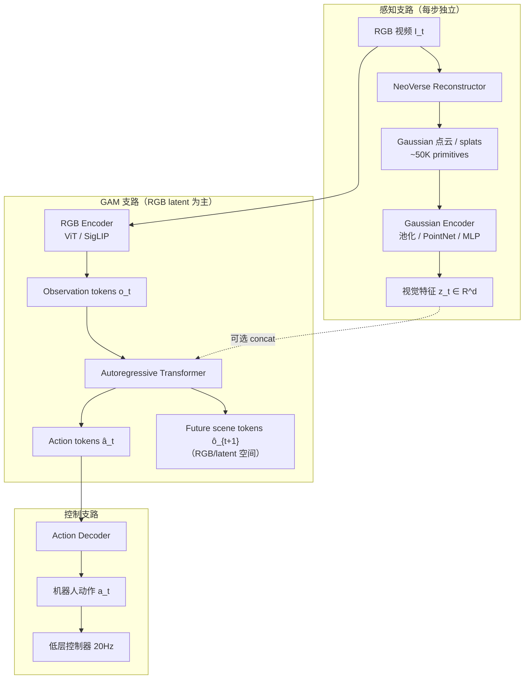
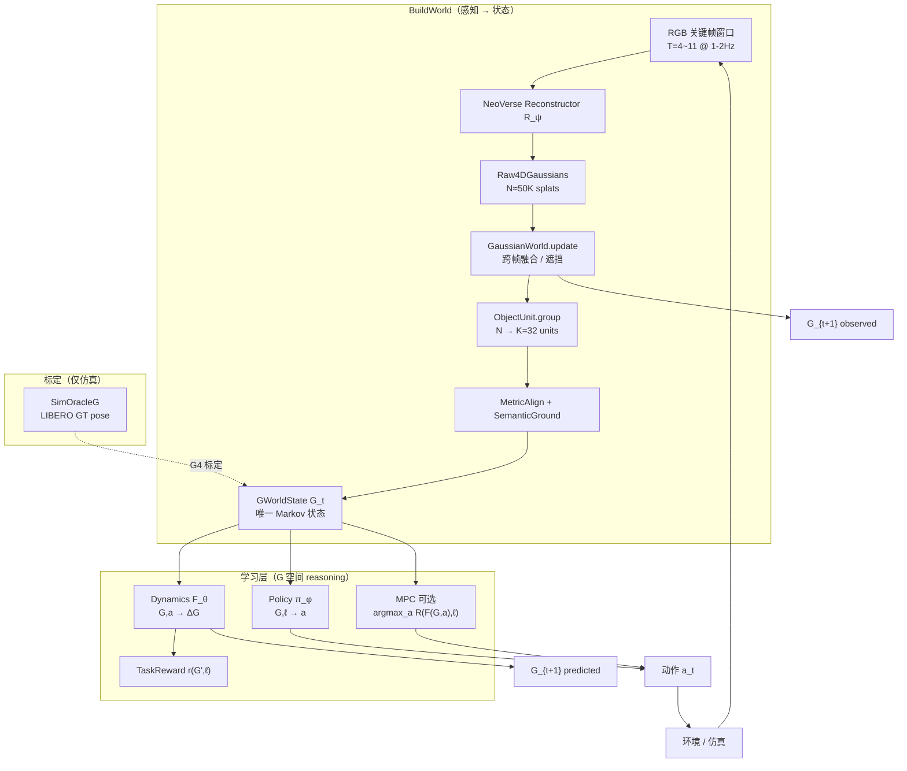

# Pipeline 对比：方案 A vs 方案 B

下面给出两个方案的**完整 pipeline**（离线训练 + 在线部署 + 数据/损失/频率），便于写 proposal 和跟导师对齐。

---

# 方案 A：Pipeline Fusion（导师批评的「表面融合」）

> NeoVerse 当视觉前端，Gaussian 当 feature，GAM 当动作头——**三条线串联，世界不是统一 reasoning 空间**。

## A.1 架构总览



## A.2 离线训练 Pipeline

```
┌─────────────────────────────────────────────────────────────────┐
│ 数据：LIBERO / 真机  (I_{0:T}, a_{0:T}, ℓ, proprio)              │
└─────────────────────────────────────────────────────────────────┘
                              │
        ┌─────────────────────┼─────────────────────┐
        ▼                     ▼                     ▼
  [Stage 1]              [Stage 2]              [Stage 3]
  NeoVerse 冻结/微调      GAM 预训练              可选微调
        │                     │                     │
  I → Raw4DGS            (o_t, a_t, o_{t+1})      z_t + o_t → GAM
  → Gaussian pool        序列自回归：              端到端 BC
  → z_t = Enc(GS)        [o_t][a_t][o_{t+1}]...   L = L_action + L_future_rgb
        │                     │
        └────────── z_t 作为 side feature ──────┘

损失（典型）：
  L_total = L_AR(â_t, a_t) + λ·L_future(ô_{t+1}, o_{t+1}) + μ·L_aux(z_t)

Buffer：
  {(I_t, z_t, o_t, a_t, I_{t+1}, o_{t+1}, ℓ)}   ← 多模态，G 不持久

训练特点：
  • NeoVerse 与 GAM **分开训** 或 **弱耦合 fine-tune**
  • Future prediction 在 **RGB/latent**，不在 **显式几何 G**
  • Gaussian 是 **附加 feature**，不是 Markov 状态
```

## A.3 在线推理 Pipeline

```
时刻 t：
  ┌─ 30Hz 相机 ─────────────────────────────────────────┐
  │                                                      │
  │  I_{t-T:t} ──→ NeoVerse ──→ GS ──→ Enc ──→ z_t      │  ~1-2Hz
  │       │                                              │
  │       └──→ RGB Enc ──→ o_t ──→ GAM AR ──→ â_t       │  ~2-5Hz
  │                      ↑                               │
  │                   concat z_t (可选)                  │
  │                                                      │
  │  â_t ──→ 低层跟踪 ──→ 机器人                          │  20Hz
  └──────────────────────────────────────────────────────┘

下一时刻 t+1：
  重新从 RGB 建 GS / 重算 z_{t+1}   ← 无持久 G_t，无 F(G,a)
  GAM 预测 ô_{t+1} 在图像空间       ← 与真实几何 G' 不对齐
```

## A.4 数据流与接口

| 阶段 | 输入 | 中间表示 | 输出 | 持久状态 |
|------|------|----------|------|----------|
| NeoVerse | RGB 窗口 | Raw4DGS | z_t (feature) | ❌ 每步重建 |
| GAM | o_t (+z_t) | token 序列 | a_t, ô_{t+1} | ❌ 隐式 latent |
| Policy | â_t | — | EE 轨迹 | ❌ |

## A.5 问题（导师批评点）

```
• Gaussian 是 CNN feature 的 3D 版，不进 rollout
• Action head 与 Future head 共享 AR，但 future 在 RGB 不在 G
• P(a|o) 与 P(o'|o) 耦合在 latent，不在显式 4D 几何
• NeoVerse 可被换成任意 depth/segmentation，世界无「物理外部记忆」
```

---

# 方案 B：Explicit 4D World Model（方案 D + 导师意图）

> **G 是唯一 Markov 状态**；NeoVerse 只负责建 G；**F 与 π 在同一几何空间里耦合 world 与 action**。

## B.1 架构总览



## B.2 状态定义（核心）

```
G_t = {
  units[0..K-1]: { μ(3), vel(3), quat(4), contact(1),
                   sem(D), vis, unc, mask }
  robot:         { ee_pose(7), gripper(1), q(n) }
  meta:          { scale, confidence, t, source }
}

flat: G_flat ∈ R^{D_g}   （供 F_θ, π_φ 使用）

语义：
  G_t = 机器人在 t 时刻对「显式 4D 世界」的信念
  不是 feature，是 rollout / reward / policy 的载体
```

## B.3 离线训练 Pipeline（完整）

```
┌──────────────────────────────────────────────────────────────────┐
│ Phase 0 — NeoVerse 前端跑通                                       │
├──────────────────────────────────────────────────────────────────┤
│ LIBERO HDF5 clip → NeoVerse R_ψ → Raw4DGaussians                 │
│ 产出：raw4d_gaussians.npz, gaussians.ply, summary.json           │
│ 闸门：G-N0 不 OOM；G-N1 μ 点云合理                                │
└──────────────────────────────────────────────────────────────────┘
                              │
                              ▼
┌──────────────────────────────────────────────────────────────────┐
│ Phase 1 — 离线 Buffer 构建                                        │
├──────────────────────────────────────────────────────────────────┤
│ 对每条 LIBERO 轨迹 (I, a, ℓ, proprio):                            │
│                                                                  │
│   for t in trajectory:                                           │
│     Raw_t  = NeoVerse(I_{t-T:t})                                 │
│     G_t    = BuildWorld(Raw_t, cache, proprio, ℓ)                │
│     G_{t+1}= BuildWorld(Raw_{t+1}, ...)                          │
│     r_t    = TaskReward(G_{t+1}, ℓ)   # e.g. bowl→plate μ 距离   │
│     buffer.add(G_t, a_t, r_t, G_{t+1}, ℓ)                        │
│                                                                  │
│ 并行：SimOracleG → G_oracle 用于 G4 标定 & F 监督上界             │
│ 产出：GWorldReplayBuffer  (G,a,r,G',ℓ)                           │
└──────────────────────────────────────────────────────────────────┘
                              │
              ┌───────────────┴───────────────┐
              ▼                               ▼
┌─────────────────────────┐     ┌─────────────────────────┐
│ Phase 2 — 训 F_θ        │     │ Phase 1b — G4 标定       │
├─────────────────────────┤     ├─────────────────────────┤
│ 输入：(G_t, a_t)        │     │ ||μ_neoverse - μ_oracle||│
│ 输出：Δμ, Δvel, contact │     │ 闸门：< 5cm               │
│                         │     └─────────────────────────┘
│ L_F = L1(Δμ) + L1(Δvel) │
│     + 0.5·CE(contact)   │
│     + 0.1·L_pen           │
│ 闸门 G2：接触 Δμ < 2cm   │
└─────────────────────────┘
              │
              ▼
┌─────────────────────────┐
│ Phase 3 — 训 π_φ (BC)   │
├─────────────────────────┤
│ 输入：(G_t, ℓ)          │
│ 输出：a_t               │
│ L_π = ||a_pred - a_demo||│
│ 或 DAgger + F rollout   │
│ 闸门 G3：success > 30%  │
└─────────────────────────┘
              │
              ▼
┌─────────────────────────┐
│ Phase 4 — BuildWorld 完善│
│ Phase 5 — MBRL (可选)   │
└─────────────────────────┘
```

## B.4 在线推理 Pipeline（完整）

```
初始化：cache = ∅, G_0 = BuildWorld(first_frames)

主循环 @ 控制频率 2-5Hz：
┌─────────────────────────────────────────────────────────────┐
│ 1. 感知更新 @ 1-2Hz                                          │
│    I_{t-T:t} → NeoVerse R_ψ → Raw4D                          │
│              → GaussianWorld.update(cache, Raw4D)            │
│              → ObjectUnit → MetricAlign → G_t                │
│                                                              │
│ 2. 决策（二选一或混合）                                       │
│    (a) 直接策略：  a_t = π_φ(G_t, ℓ)                         │
│    (b) MPC：       a_t = argmax_a R(F_θ(G_t,a), ℓ)           │
│                    # 在 G 空间想象未来再选动作                  │
│                                                              │
│ 3. 执行 @ 20Hz                                               │
│    a_t → 低层跟踪 / Franka controller                        │
│                                                              │
│ 4. 世界演化（两条路）                                         │
│    观测路：下一关键帧 → 重复 Step 1 → G_{t+1}^{obs}          │
│    模型路：G_{t+1}^{pred} = G_t ⊕ F_θ(G_t, a_t)  （MPC/规划）│
└─────────────────────────────────────────────────────────────┘

关键：π 和 F 都只吃 G，不吃 RGB latent
```

## B.5 与 GAM 哲学对齐的「序列视图」（方案 B 的叙事版）

虽实现上是 F + π 而非单一 AR，逻辑序列是：

```
[G_t tokens: u_1 … u_K, robot]
        ↓  F_θ(G_t, a_t)
[G'_{t+1} tokens: Δμ, Δvel, contact]
        ↓  与 BuildWorld(G_{t+1}^{obs}) 对齐
[a_t] ← π_φ(G_t, ℓ) 或 MPC over F
        ↓
[G_{t+1}] → 循环
```

对应导师公式：**P(G_{t+1}, a_t | G_t)** 被分解为 **F(G,a)** + **π(G,ℓ)** + **共享 G**，而非两个 disconnected RGB head。

## B.6 数据 / 模块 / 频率对照

| 模块 | 包路径 | 输入 | 输出 | 频率 |
|------|--------|------|------|------|
| NeoVerseReconstructor | `neoverse_adapter.py` | RGB 窗口 | Raw4DGaussians | 1-2 Hz |
| BuildWorld | `world.py` | raw, cache, ℓ | G_t | 1-2 Hz |
| Dynamics F | `dynamics/model.py` | G, a | ΔG | 训练 / MPC |
| Policy π | `policy/model.py` | G, ℓ | a | 2-5 Hz |
| ReplayBuffer | `buffer/replay.py` | transitions | batch | 离线 |
| TaskReward | `reward/task.py` | G', ℓ | r | 离线 |

## B.7 MVP 任务与闸门

```
任务：LIBERO spatial task0（pick black bowl → plate）

Go/No-Go：
  G-N0  NeoVerse 5070Ti 不 OOM
  G-N1  μ 点云目视合理
  G4    NeoVerse μ vs Oracle < 5cm
  G2    F 接触预测 Δμ < 2cm
  G3    BC π closed-loop success > 30%
```

---

# 两方案并排对比

| 维度 | 方案 A Pipeline Fusion | 方案 B Explicit 4D（方案 D） |
|------|------------------------|------------------------------|
| **核心状态** | RGB latent o_t + 可选 z_t | **GWorldState G_t** |
| **NeoVerse 角色** | 视觉 feature 提取器 | **世界构建器 R_ψ** |
| **Gaussian 角色** | Enc(GS) → z，每步丢弃 | **持久 G**，跨帧融合 |
| **Action** | GAM action tokens | **π(G,ℓ)** 或 MPC(F) |
| **Future** | Future RGB/latent tokens | **F(G,a)→G'** 几何预测 |
| **联合建模** | AR 在 latent 空间 | **F+π 在 G 空间耦合** |
| **Rollout** | 无显式几何 rollout | **G_{t+1}=F(G_t,a_t)** |
| **Reward** | 通常 task-specific on image | **r(G',ℓ)** on μ |
| **导师认可** | ❌ 表面融合 | ✅ 世界即 reasoning space |

---

# 一句话总结

- **方案 A**：`RGB → NeoVerse → feature → GAM → action`（世界不进 Markov 链）
- **方案 B**：`RGB → NeoVerse → G_t → {F, π, r} → a → 世界演化 → G_{t+1}`（**G 是唯一认知载体**）

当前仓库实现的是 **方案 B**；若导师要看到更接近 GAM 的 **单序列 AR**，可在 B 的 Phase 5 加 `Transformer([G_t, a_t, G_{t+1}])`，作为 extension，不必退回方案 A。
